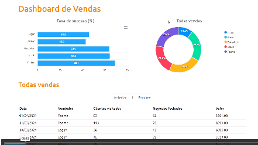

<div align="center" id="top"> 
<h1 align="center">sales-dashboard</h1>

<p align="center">

  

  

  

  

  

  

   
</p>

<!-- Status

<h4 align="center">
	🚧  sales-dashboard 🚀 Under construction...  🚧
</h4>
-->

&#xa0;

<p align="center">
  <a href="#sparkles-features">Features</a> &#xa0; | &#xa0;
  <a href="#rocket-technologies">Technologies</a> &#xa0; | &#xa0;
  <a href="#white_check_mark-requirements">Requirements</a> &#xa0; | &#xa0;
  <a href="#checkered_flag-starting">Starting</a> &#xa0; | &#xa0;
  <a href="#trophy">Activities</a> &#xa0; | &#xa0;
  <a href="#books-references">References</a> &#xa0; | &#xa0;
  <a href="#memo-license">License</a> &#xa0; | &#xa0;
  <a href="https://github.com/acenelio" target="_blank">Author</a>
</p>



<br>

[](https://app.netlify.com/sites/dashboard-jocile/deploys)

<a href="https://dashboard-jocile.netlify.app/">Demo</a>

</div>
<hr>

## :dart: About

Design of a web application sales performance analysis dashboard with spring backend and react frontend, form the [DevSuperior](https://devsuperior.com.br/) course.

## :sparkles: Features

:heavy_check_mark: Sales performance analysis dashboard listing;\
:heavy_check_mark: Sales dashboard with statiscal charts;\
:heavy_check_mark: Total sales search by seller - filling the donut chart;\
:heavy_check_mark: Success rate search by seller - filling the bar chart;\
:heavy_check_mark: Paged search of sales;\
:heavy_check_mark: Detailed sales list;\
:heavy_check_mark: API documentation with springdoc-openapi;\
:heavy_check_mark: Frontend access with [Netlify](https://dashboard-jocile.netlify.app/);\
:heavy_check_mark: Database with Postgres;\
:heavy_check_mark: Backend access with [Heroku](https://sales-dashboard-jocile.herokuapp.com/sellers);

## :rocket: Technologies

The following tools were used in this project:

:heavy_check_mark: [Java JDK 11](https://docs.oracle.com/en/java/javase/11/);\
:heavy_check_mark: [Maven builder](https://maven.apache.org/);\
:heavy_check_mark: [Spring Boot framework](https://glysns.gitbook.io/springframework/);\
:heavy_check_mark: [Spring Data JPA](https://docs.spring.io/spring-boot/docs/2.5.6/reference/htmlsingle/#boot-features-jpa-and-spring-data);\
:heavy_check_mark: [Swagger implementing springdoc-openapi](https://springdoc.org/);\
:heavy_check_mark: [Yarn - package management](https://yarnpkg.com/);\
:heavy_check_mark: [ReactJS user interfaces](https://pt-br.reactjs.org/);\
:heavy_check_mark: [React Native](https://reactnative.dev/);\
:heavy_check_mark: [TypeScript](https://www.typescriptlang.org/);\
:heavy_check_mark: [Bootstrap web framework](https://getbootstrap.com/);\
:heavy_check_mark: [Apexcharts.js library](https://apexcharts.com/);\
:heavy_check_mark: [Netlify web app server](https://www.netlify.com/);\
:heavy_check_mark: [Postgresql 12 database](https://www.postgresql.org/about/news/postgresql-12-released-1976/);\
:heavy_check_mark: [PgAdmin database administration platform](https://www.pgadmin.org/);\
:heavy_check_mark: [Heroku - plataform as a service](https://www.heroku.com/);

## :white_check_mark: Requirements

Before starting :checkered_flag:, you need to have [Git](https://git-scm.com), [yarn](https://yarnpkg.com/) and [Java 11](https://docs.oracle.com/en/java/javase/11/) installed.

## :checkered_flag: Starting

```bash
# Clone this project
$ git clone https://github.com/jocile/sales-dashboard

# Access
$ cd sales-dashboard/frontend

# Install dependencies
$ yarn

# Run the project frontend
$ yarn start
```

> The local frontend server will initialize in the browser: <http://localhost:3000>\
> and Dashboard URL route will be initialized in: <http://localhost:3000/dashboard>

```bash
# Access the backend server with the following
$ cd ../backend

# Run the backend interface with
$ ./mvnw spring-boot:run
```

> The local backend server will initialize in the browser: <http://localhost:8080/swagger-ui/index.html>\
> and in-memory database H2 will be initialized in <http://localhost:8080/h2-console>

## :trophy: Activities

- :heavy_check_mark: Created Git monorepo;
- :heavy_check_mark: Created Frontend:
  - :heavy_check_mark: Created static frontend look with Bootstrap and CSS;
  - :heavy_check_mark: Create visual static components with ReactJS;
  - :bar_chart: Create statiscal charts with apexcharts;
  - :heavy_check_mark: Build the front end with Yard;
  - :heavy_check_mark: Deploy the front end to Netlify;
- :heavy_check_mark: Create the backend:
  - :heavy_check_mark: Organized the project in layers with Spring Boot:
    - :heavy_check_mark: Web, JPA, H2, Postgres and Security;
  - :heavy_check_mark: Create REST Service;
    - :heavy_check_mark: Create REST web services;
    - :heavy_check_mark: DTO Standard;
  - :heavy_check_mark: Create REST Repository (data access);
    - :heavy_check_mark: Create entities;
    - :heavy_check_mark: Database seeding;
    - :heavy_check_mark: Associations between entities (N-N);
  - :heavy_check_mark: Create REST controller:
    - :heavy_check_mark: Swagger UI (Open API3 collections, environments);
    - :heavy_check_mark: Data pagination with pageable, page, size, sort;
    - :heavy_check_mark: Response from ResponseEntity<T> request;
- :heavy_check_mark: Frontend dynamically loading data from the backend;
  - :heavy_check_mark: URL path route parameters;
  - :heavy_check_mark: DonutChart request integration;
  - :heavy_check_mark: BarChart request integration;
  - :heavy_check_mark: DataTable request integration;
    - :heavy_check_mark: props components pagination;
  - :heavy_check_mark: frontend on Netlify making backend requests on Heroku

## :books: References

- :file_folder: [App documentation](documentation/);
- :link: [Bootcamp Documentation SDS 5 pt-BR](https://github.com/devsuperior/sds5);
- :link: [Official Apache Maven documentation](https://maven.apache.org/guides/index.html);
- :link: [Spring Boot Maven Plugin Reference Guide](https://docs.spring.io/spring-boot/docs/2.4.12/maven-plugin/reference/htmlsingle/);
- :link: [Create an OCI image](https://docs.spring.io/spring-boot/docs/2.4.12/maven-plugin/reference/html/#build-image);
- :link: [Spring Web](https://docs.spring.io/spring-boot/docs/2.5.6/reference/htmlsingle/#features.developing-web-applications);
  - :link: [Building a RESTful Web Service](https://spring.io/guides/gs/rest-service/);
  - :link: [Serving Web Content with Spring MVC](https://spring.io/guides/gs/serving-web-content/);
- :link: [Spring Data JPA](https://docs.spring.io/spring-boot/docs/2.5.6/reference/htmlsingle/#features.sql.jpa-and-spring-data);
  - :link: [Accessing Data with JPA](https://spring.io/guides/gs/accessing-data-jpa/);
- :link: [Spring Security](https://docs.spring.io/spring-boot/docs/2.7.0/reference/htmlsingle/#web.security);
  - :link: [Securing a Web Application](https://spring.io/guides/gs/securing-web/);
  - :link: [Enabling Cross Origin Requests for a RESTful Web Service](https://spring.io/blog/2022/02/21/spring-security-without-the-websecurityconfigureradapter)
  - :link: [Spring Boot and OAuth2](https://spring.io/guides/tutorials/spring-boot-oauth2/);
  - :link: [Authenticating a User with LDAP](https://spring.io/guides/gs/authenticating-ldap/);
- :link: [Tutorial: Intro to React](https://reactjs.org/tutorial/tutorial.html);
  - :link: [React Bootstrap](https://react-bootstrap.github.io/);
  - :link: [Upgrading React Router](https://reactrouter.com/docs/en/v6/upgrading/reach);
  - :link: [Styled components in React](https://styled-components.com/docs/basics);
- :link: [TypeScript Documentation](https://www.typescriptlang.org/docs/);

## :memo: License

This project is under license from MIT. For more details, see the [LICENSE](LICENSE.md) file.

Made with :heart: by <a href="https://github.com/jocile" target="_blank">Jocile</a>

&#xa0;

<a href="#top">Back to top</a>
