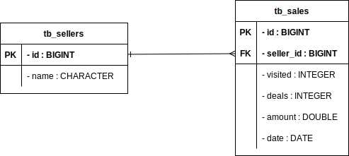

&#xa0;

<h1>Entities ER diagram</h1>

> Design of the conceptual model of the entities relationship.

<h1>Data Model diagram</h1>

> Design of the data model of the entities relationship.

<h1>Class diagram</h1>

> Design of the class layers diagram.

:computer: Modeled by [diagrams.net](https://github.com/jocile/Modeling) and made with :heart: by <a href="https://github.com/jocile" target="_blank">Jocile</a>

&#xa0;

[Index](https://github.com/jocile/sales-dashboard) | <a href="#top">Back to top</a>

